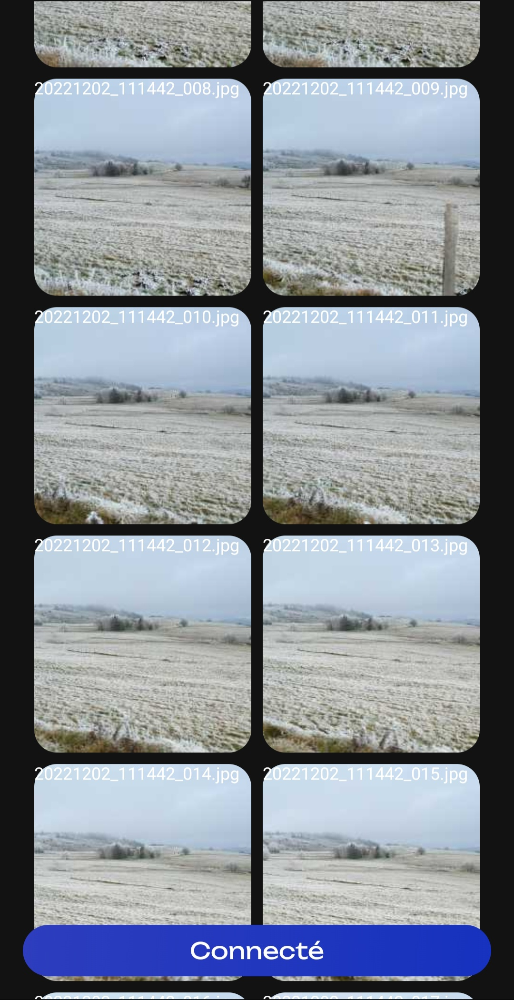

# OtterFiles

## Introduction

OtterFiles is both an android app and desktop app that lets you transfer files locally from your android phone to your PC.<br>
Remotely select files from the desktop app that you want to download.

## Preview




## Installation Guide

1. Clone repo on Android studio <br>
2. Launch the mobile app into your android phone <br>
2. Create new configuration with Gradle and put this on run ```shell jvmRun -DmainClass=com.shibler.transferfiles.MainKt --quiet ``` <br>
3. Launch the desktop app <br>
4. Clic on the top left button in the desktop app to get the list of all your files <br>


## Limitations

Only works when both devices are connected to the same network.<br>
Speed transfer depends on the network speed and devices limitations.

## Technologies

- [Kotlin](https://kotlinlang.org/)
- [Compose]()
- ServerSocket


---

Learn more about [Kotlin Multiplatform](https://www.jetbrains.com/help/kotlin-multiplatform-dev/get-started.html)…
